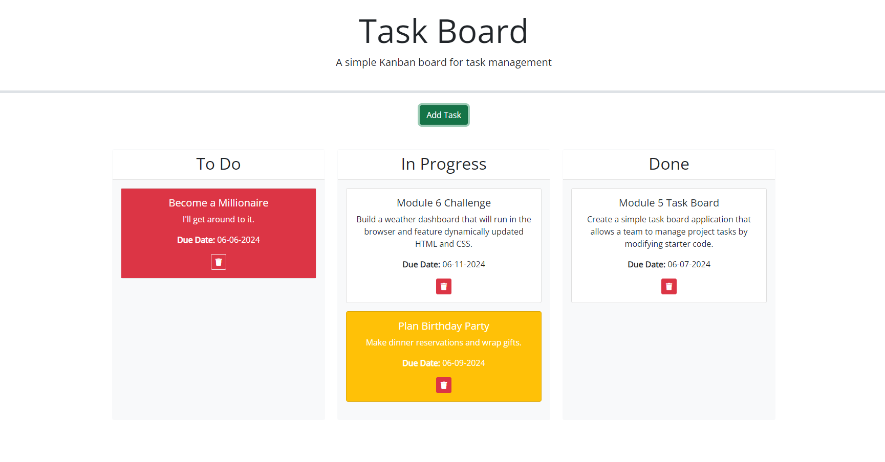

# Task Board

## Description

The goal of this project was to create a kanban-style task board, with functionality to add individual project tasks, manage their state of progress, and track their progress accordingly.

## Completed Tasks

- [x] Created a modal in the html using bootstrap and jquery, with a form for title, description, and deadline.
- [x] Displayed entered tasks in columns representing the state of progress on the task.
- [x] Using bootstrap, added color coding to task cards to indicate how close to the deadline it is, based on days.js datepicker.
- [x] Made tasks draggable between columns
- [x] Made tasks deletable so they do not persist after page refresh.

## Screenshot

## Deployed Application

[https://deadseatupperware.github.io/Homework5-Task-Board/](https://deadseatupperware.github.io/Homework5-Task-Board/)

[Github Repository](https://github.com/DeadSeaTupperware/Homework5-Task-Board)

